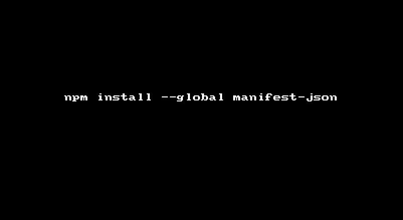

# manifest-json

> Creates a Webapp [manifest](https://w3c.github.io/manifest/) for your PWA.


## Install

```sh
$ npm install --global manifest-json
```


## Usage

```sh
$ manifest-json
```

## GIF


## TODO 

* Provide flags for each option on CLI.

* Ask for `lang`, `scope`, `splash-screen` ?

* More validations for `url` and `color`.

## License

MIT © [Hemanth.HM](http://h3manth.com)
